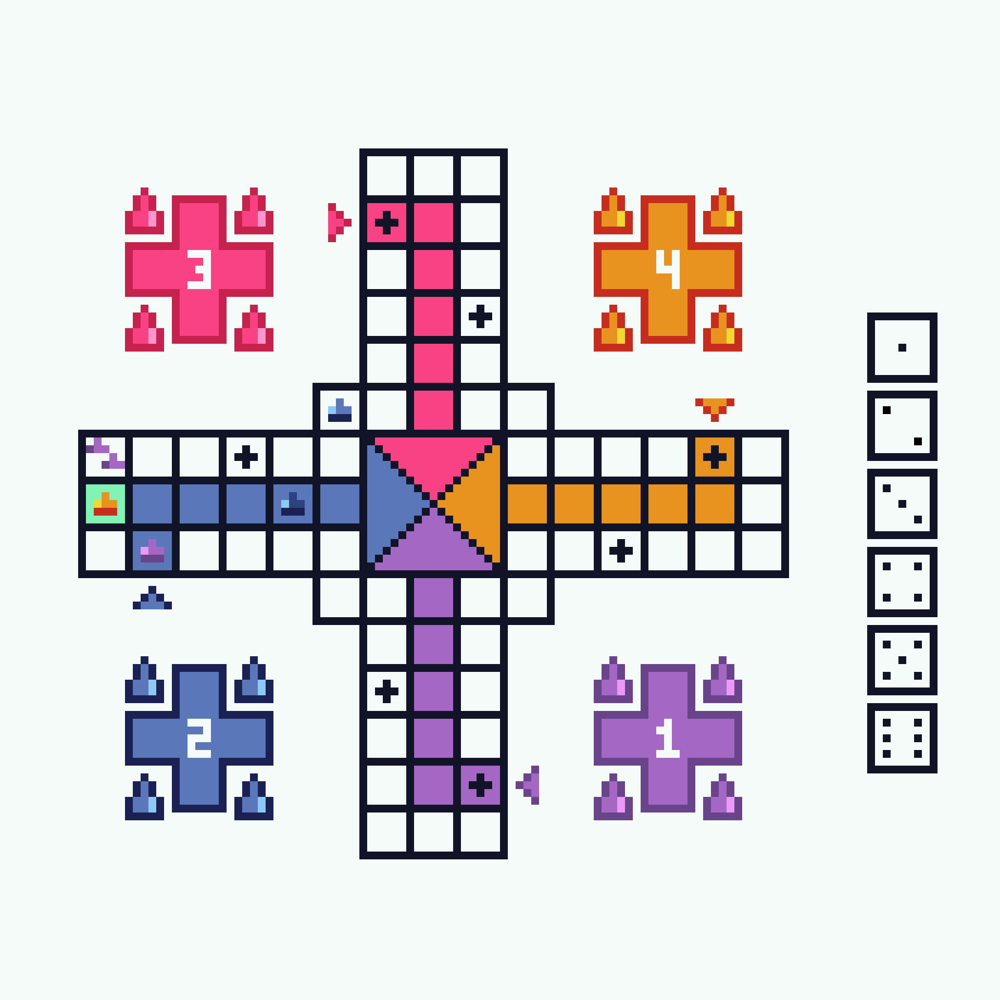

# Projeto de Arquitetura

Atividade em dupla que consiste em implementar o jogo Ludo, utilizando Assembly do processador MIPS.

  

Saiba mais sobre o jogo em [Wikipedia](https://pt.wikipedia.org/wiki/Ludo).

## Integrantes

- [Daniel Nasc](https://github.com/danielnasc)
- [Luma Araujo](https://github.com/Sahinake)
